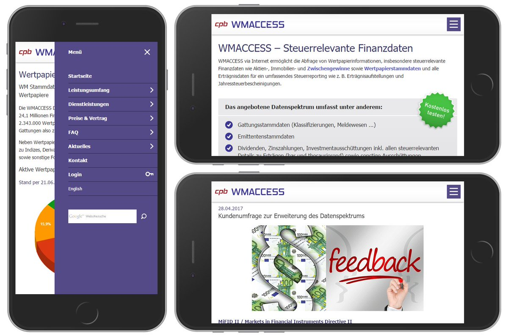

{:style="float: right; padding-left: 10px"} [wmAccess](https://www.wmaccess.com/en/) is an OLAP and reporting system for securities listed on [Wertpapier-Mitteilungen](https://www.wmdaten.de/index.php?mid=20) in Germany. Allows share-trading person to do analysis on securities trending to help making trading decisions.

#### Highlights  
* Developed to explore data link provided by WM
* Uses experience gathered in creating analyse components for [iSectras project](iSectras.md) to offer them to general financial public
* Very fast queries (5 times faster than [WM own reporting system](https://www.wmdaten.de/index.php?cid=145))
* User friendly interface
* Subscription model

### Technologies used
* Java
* Hibernate
* JSP
* Struts
* Oracle DB
* IBM DB2
* Ajax, JavaScript and DHTML
* XML and Soap­RPC
